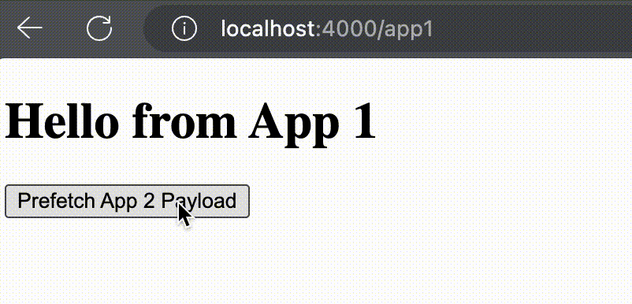

# React Multi App Handoff

[Design doc](https://docs.google.com/document/d/1nYR_ZaZNaAB8GE6MZB-5fmZ3xzTgoYalEtqpXIiH8kQ/edit?usp=sharing)

This is a POC that implements "switching" between React apps without reloading the document. It also simulates "RSC payload" requests to gather resources needed on the client to render the subsequent app.



## Quickstart

```
npm i && npm start
```

## Project Structure

The project consists of 2 "apps" and a proxy.

- Each app is an express server that serves static HTML & JS files, and responds to "RSC payload" requests.
- The proxy simply routes requests to the respective app.

The proxy runs on port `4000`, and apps 1 and 2 run on `4001` and `4002` respectively.

## App Mechanics

For simplicity, each app only renders a single page. App 1 renders `/app1`, and App 2 renders `/app2`.

Each app server has a `BUILD_ID` (accessed via `process.env`) that's used as a unique identifier for the application build. Static files are served from the path starting with the `BUILD_ID`:

```js
app.use(`/${APP_BUILD_ID}/public`, express.static("public"));
```

For this demo, App 1's build ID is `123` and App 2's is `456`.

Each page request responds with a similar HTML file (which should be generated at build time, but isn't for this simple case).

```html
<!DOCTYPE html>
<html>
  <head>
    <!-- React Scripts -->
    <script
      src="https://unpkg.com/react@18/umd/react.development.js"
      crossorigin
    ></script>
    <script
      src="https://unpkg.com/react-dom@18/umd/react-dom.development.js"
      crossorigin
    ></script>
  </head>
  <body>
    <div id="root"></div>
    <!-- "Harness" for switching between apps -->
    <script src="123/public/index.js"></script>
    <!-- App 1's main JS -->
    <script src="123/public/dist/main.js"></script>
  </body>
</html>
```

The "harness" file includes

- Listeners that will start the next app's main when the respective "switch app" event is dispatched.
- A callback that will start the current app's main when the DOM content has loaded.

```js
// Generated listeners for each "app" change
window.addEventListener("SWITCH_TO_APP_123", () => {
  main_123();
});
window.addEventListener("SWITCH_TO_APP_456", () => {
  main_456();
});

// Start main for the current app when DOM content has loaded
document.addEventListener("DOMContentLoaded", () => {
  main_123();
});
```

Each app's main.js can be generated as well:

```jsx
function main_123() {
  const APP_BUILD_ID = "123";

  const container = document.getElementById("root");
  const root = ReactDOM.createRoot(container);
  root.render(<App appId={APP_BUILD_ID} />);

  window.addEventListener(`UNMOUNT_APP_${APP_BUILD_ID}`, () => {
    root.unmount();
  });
}
```

For this simple example, we are using `ReactDOM` to render the app onto the root `div` element, and unmounting the app when a specific event is dispatched. NextJS probably has a more complicated bootstrap process (including hydration).

The UI for this example is quite simple. There's some text indicating which app is currently mounted, a prefetch button to fetch the "RSC payload", and a navigate button to switch apps. In practice these will probably be a part of the router's code.

```jsx
function App1({ appId }) {
  // Not bringing in RQ or SWR to keep things simple
  const [payload, setPayload] = useState(null);
  const [loading, setLoading] = useState(false);

  const prefetch = async () => {
    /*...*/
  };
  const navigate = () => {
    /*...*/
  };

  return (
    <>
      <h1>Hello from App 1</h1>
      <button onClick={prefetch} disabled={loading}>
        Prefetch App 2 Payload
      </button>
      {loading ? <p>Loading...</p> : null}
      {data ? <button onClick={navigate}>Go to App 2</button> : null}
    </>
  );
}
```

Prefetch makes an "RSC payload" request and then adds script tags for the next app's source code.

```js
const prefetch = async () => {
  try {
    setLoading(true);
    const res = await fetch("/app2?_rsc=2");
    const data = await res.json();
    data?.files?.forEach((path) => {
      const src = `${data?.appId}/${path}`;
      if (document.querySelectorAll(`[src="${src}"]`).length === 0) {
        const script = document.createElement("script");
        script.src = src;
        document.body.appendChild(script);
      }
    });
    setPayload(data);
  } catch (error) {
    console.error(error);
  } finally {
    setLoading(false);
  }
};
```

Navigate tells the browser to unmount the current app, and then tells the harness to mount the subsequent app. Then it does a shallow update to the window's location to reflect the route change.

```js
const navigate = () => {
  const nextAppId = payload?.appId;
  if (nextAppId) {
    window.dispatchEvent(new Event(`UNMOUNT_APP_${appId}`));
    window.dispatchEvent(new Event(`SWITCH_TO_APP_${nextAppId}`));
    window.history.replaceState({}, "", `/app2`);
  }
};
```
